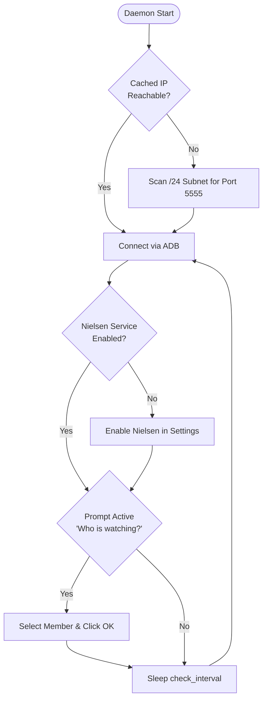

<div align="center">

# 📺 Nielsen TV Accessibility Keeper

**A robust, lightweight Rust daemon that keeps Nielsen's Accessibility Service active on Android TV via ADB and autonomously dismisses periodic survey prompts.**

[](https://github.com/Praveensenpai/nielsen-tv-enabler/releases)
[](https://www.rust-lang.org/)
[](https://github.com/Praveensenpai/nielsen-tv-enabler)
[](LICENSE)

[⚡ Quick Install](#-quick-1-click-install) • [✨ Features](#-key-features) • [🔄 Architecture](#-architecture--workflow) • [💻 CLI Usage](#-cli-usage) • [⚙️ Configuration](#%EF%B8%8F-configuration)

</div>

---

## 📖 Overview

On many Android TVs, accessibility services (like Nielsen's `com.nlsn.confluencetv` logging service) get silently disabled after system updates, sleep cycles, or reboots. Additionally, Nielsen displays an intrusive modal asking **"Who is watching?"** that blocks TV viewing until answered.

**`nielsen-tv-enabler`** solves both problems autonomously in the background:
- 🛡️ **Guarantees Continuous Operation**: Verifies accessibility settings and re-enables Nielsen within seconds if it drops.
- 🎯 **Automated Prompt Dismissal**: Inspects screen dumps, randomly selects a registered household member, clicks OK, and restores playback.
- 🔌 **Zero Network Configuration**: Automatically discovers your Android TV across your `/24` local subnet using concurrent TCP port probing.

---

## ✨ Key Features

| Feature | Description |
|---|---|
| **🤖 Survey Auto-Dismissal** | Scans for *"Who is watching?"* dialogs, calculates checkbox coordinates, picks a member, clicks OK, and dismisses the overlay. |
| **🛡️ VPN Access Auto-Approval** | Grants `ACTIVATE_VPN` app-op permission and automatically approves Android system VPN connection request dialogs (`com.android.vpndialogs`). |
| **🔍 Subnet Auto-Scanning** | Scans all 254 hosts on your local subnet in parallel over port `5555` to automatically find your TV's IP. |
| **⚡ Fast IP Caching** | Caches the last verified working IP for instant reconnects without redundant subnet sweeps. |
| **💤 Graceful Backoff** | Backs off cleanly when the TV is asleep or turned off without spamming system logs. |
| **🔒 Safe & Non-Destructive** | Preserves all other active accessibility services (e.g. TalkBack, button remappers) by appending rather than replacing. |
| **🚀 Systemd Integration** | Native user systemd unit management with one-command install, status, and removal. |

---

## 🔄 Architecture & Workflow



---

## ⚡ Quick 1-Click Install

Run this single command on your Linux system to download, install the binary, and start the systemd user service:

```bash
curl -fsSL https://raw.githubusercontent.com/Praveensenpai/nielsen-tv-enabler/main/install.sh | bash
```

> [!TIP]
> Ensure ADB is installed on your machine (`sudo apt install adb` on Debian/Ubuntu or `sudo pacman -S android-tools` on Arch Linux).

---

## 🛠️ Build from Source

```bash
# Clone the repository
git clone https://github.com/Praveensenpai/nielsen-tv-enabler.git
cd nielsen-tv-enabler

# Build and install locally via Cargo
cargo install --path .

# Install and activate systemd user daemon
nielsen-tv-enabler --install-service
```

---

## 💻 CLI Usage

### Daemon & Background Service (Recommended)

| Action | Command |
|---|---|
| **Install & start user service** | `nielsen-tv-enabler --install-service` |
| **Check service status** | `nielsen-tv-enabler --status-service` |
| **Stream live logs** | `journalctl --user -u nielsen-tv-enabler.service -f` |
| **Stop & uninstall service** | `nielsen-tv-enabler --uninstall-service` |

---

### On-Demand & Diagnostics Modes

```bash
# Execute a single verification pass and exit
nielsen-tv-enabler --once

# Scan local subnet for available Android TV / ADB devices
nielsen-tv-enabler --scan

# Auto-detect Nielsen accessibility component on target TV
nielsen-tv-enabler --detect

# Immediately dismiss 'Who is watching?' prompt if on screen
nielsen-tv-enabler --dismiss-prompt

# Grant VPN access permission and approve active VPN connection request dialog
nielsen-tv-enabler --allow-vpn

# Run in foreground with verbose debug logs
nielsen-tv-enabler --daemon -v
```

---

## ⚙️ Configuration

Settings are stored at `~/.config/nielsen-tv-enabler/config.toml` and generated automatically on first run:

```toml
# "auto" uses cached last_known_ip first, then scans subnet if unreachable
tv_ip = "auto"

# Target ADB port (default: 5555)
adb_port = 5555

# Last verified IP address of the Android TV (auto-updated)
last_known_ip = "192.168.1.35"

# Nielsen component name ("auto" auto-detects from dumpsys / pm)
service_component = "com.nlsn.confluencetv/nielsen.imi.acsdk.services.NxtLogService"

# Interval in seconds between checks while connected
check_interval_secs = 5

# Backoff retry interval in seconds when TV is offline or sleeping
offline_retry_interval_secs = 45

# Optional subnet CIDR override (e.g. "192.168.0.0/24")
subnet_cidr = ""

# Automatically answer 'Who is watching?' survey dialogs
auto_handle_who_is_watching = true

# Automatically grant VPN permission and approve VPN connection request dialogs
auto_allow_vpn = true
```

### CLI Overrides
Any setting can be overridden on the command line:
- `-i, --ip <IP>`: Explicit TV IP address
- `-p, --port <PORT>`: Target ADB port
- `-s, --service <COMPONENT>`: Accessibility service component
- `-t, --interval <SECONDS>`: Polling interval in seconds
- `-c, --config <FILE>`: Path to alternate config file

---

## 📜 License

Licensed under either of [Apache License, Version 2.0](LICENSE-APACHE) or [MIT License](LICENSE-MIT) at your option.
